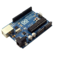
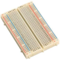
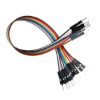
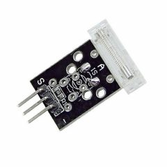
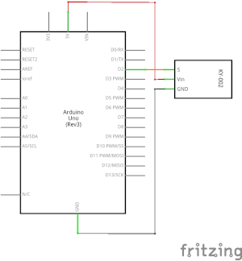

# 09 - Sensor de golpe y de vibración

## Finalidad

Presentar el sensor de golpe y de vibración (KY-002 y KY-031), además de continuar trabajando las entradas digitales para saber detectar señales muy breves.

## Material

|                                 Imagen                                 | Descripción                                                           |
| :--------------------------------------------------------------------: | :------------------------------------------------------------------- |
|       | Arduino Uno o compatible con S4A y con el firmware para S4A cargado. |
|  | Una protoboard                                                       |
|      | Cables de conexión                                                   |
|      | Un módulo KY-002, sensor de golpe                                   |
|      | Un módulo KY-031, detector de vibración                             |

## ¿Cómo funcionan los módulos?

El módulo del conmutador de vibración KY-002 (vibration switch module) exteriormente presenta una forma cilíndrica. Las dos partes activas en el interior del sensor son un muelle conductor en el centro rodeado por una placa también conductora. Esta configuración hace que cuando se aplica
cualquier tipo de golpe al módulo, el muelle entra en contacto con la cubierta cilíndrica y el circuito se cierra.

El módulo sensor de golpe KY-031 es similar al módulo de vibración. La diferencia principal entre estos dos es su sensibilidad. El sensor de vibración detecta incluso un golpe pequeño, mientras que el sensor de golpes requiere un golpe potente o una sacudida para activarlo.

Los dos módulos llevan una resistencia de 10 K Ohm incorporada entre el pin central y el pin "S" para ser usado como montaje **pull up o pull down** según se requiera. Los contactos del interruptor conectan los dos pines externos.

Ambos módulos cambian el estado del conector de salida cuando detectan el golpe o vibración y lo mantienen únicamente mientras dura la perturbación, es decir, se obtiene una señal de una duración muy breve. Si hacemos el montaje habitual tendremos una configuración pull up, la salida estará en estado alto hasta que el sensor se active que pasará a estado bajo.

## Montaje

El esquema electrónico es muy sencillo, como que tenemos una señal digital la recogeremos por la entrada 2 y aprovecharemos el led de la placa arduino, conectado al pin 13 para ver la salida.




## Programación

[Código:ARD_09.ino](../codi/ARD_09.ino)

```Arduino

int Led = 13; //asigna a la variable Led el valor de 13

int buttonpin = 2; //asigna a la variable buttonpin el valor 2

int val; //define val como entero

void setup()
{
  pinMode(Led, OUTPUT); //define el pin 13 como salida
  pinMode(buttonpin, INPUT); //define el pin 2 como entrada digital
}

void loop()
{
  val = digitalRead(buttonpin); //lee el valor de la entrada 2 y lo asigna a la variable val
  if (val == HIGH) //comprueba si el sensor está activado, recordad que si detecta la entrada 2 pasará a estado bajo
  {
    digitalWrite(Led, LOW);
  }

else //cuando el sensor envía señal, el led 13 //se enciende durante 2 segundos
  {
    digitalWrite(Led, HIGH);
    delay(2000);
  }
}
```

## Conceptos importantes

- Detección de señales muy breves
- Montaje pull-up y pull-down

## Ver también

- [README](../README.md)
