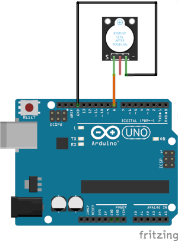
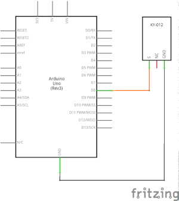

# 14 - Mòdul de brunzidor actiu

## Finalitat

- Aprendre a utilitzar el brunzidor
- Incloure avisos sonors en els nostres circuits

## Material

|                               Imatge                               | Descripció                |
| :----------------------------------------------------------------: | :------------------------ |
|   | Arduino Uno o equivalent. |
|  | Cables de connexió        |
|  | Un brunzidor actiu KY012  |

## Descripció del material

Els brunzidors electrònics funcionen amb corrent continua i estan
equipats amb un circuit integrat. S'utilitzen àmpliament en ordinadors,
impressores, fotocopiadores, alarmes, joguines electròniques,
dispositius electrònics d'automoció, telèfons, temporitzadors i altres
productes electrònics per a generar avisos. Els brunzidors es poden
classificar com a actius i passius.

El mòdul de brunzidor actiu KY-012, produeix un so d'un sols to quan la
senyal és alta. Per produir diferents tons s'utilitza el mòdul de
brunzidor passiu KY-006.

El mòdul KY-012 consisteix en un brunzidor piezoelèctric actiu, que
genera un so d'aproximadament 2,5 kHz quan el senyal és alt.

| Característica               | Valor                                 |
| ---------------------------- | ------------------------------------- |
| Voltatge de funcionament     | 3,5V ~ 5,5V                           |
| Corrent màxim                | 30mA / 5VDC                           |
| Freqüència de ressonància    | 2500Hz ± 300Hz                        |
| Sortida mínima de so         | 85Db @ 10cm                           |
| Temperatura de treball       | -20 ° C ~ 70 ° C [-4 ° F ~ 158 ° F]   |
| Temperatura d'emmagatzematge | -30 ° C ~ 105 ° C [-22 ° F ~ 221 ° F] |
| Dimensions                   | 18,5 mm x 15 mm                       |

## Muntatge

Connecteu el senyal (S) al pin 8 de l'Arduino i el negatiu (-) a GND.
Tingueu en compte que alguns mòduls estan mal etiquetats. Proveu
d'invertir els cables si no sentiu cap so mentre executeu el codi.




## Programació

Podeu descarregar el codi
[aquí](https://drive.google.com/file/d/13Mxdfbo0VG3rP-PNCun1Ep957xYQfdPR/view?usp=share_link).

```Arduino
Codi: ARD_14.ino

int buzzerPin = 8;

void setup ()
{
  pinMode (buzzerPin, OUTPUT);
}

void loop ()
{
  digitalWrite (buzzerPin, HIGH);
  delay (500);
  digitalWrite (buzzerPin, LOW);
  delay (500);
}
```

## Conceptes importants

- La importància de rebre avisos fora de l'abast de la visió

## Veure també

- [README](../README.md)
