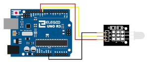

# 19 - Led de doble color

## Objectiu

- Conèixer i comprendre el funcionament del led de doble color

## Material

|                                  Imatge                                  | Descripció                    |
| :----------------------------------------------------------------------: | :---------------------------- |
|         | Arduino Uno o equivalent.     |
|    | Protoboard                    |
|        | Cables de connexió            |
|        | Mòdul led dos colors (KY-029) |
|  | 2 Resistències 220 o 330 Ω    |

## Descripció

Mòdul LED de 5 mm de doble color per a Arduino (KY-029), emet llum roja
i verda. Pot ajustar la quantitat de cada color usant PWM. Aquest mòdul
és similar al KY-011. El pin "R" representa el color roig i el pin
"Y" representa el color verd, el pin G es connecta a GND.

## Característiques

Aquest mòdul consta d'un LED roig/verd de càtode comú de 5 mm i sense
resistència. Utilitze aquest mòdul amb algunes resistències limitadores
per a evitar que el LED es creme quan treballe durant llargs períodes de
temps.

- Voltatge de treball: 2,3-2,6 V per a verd, 1,9-2,2 V per a roig
- Corrent de treball: 20mA
- Diàmetre: 5 mm
- Encapsulat: Difusió
- Color: roig/verd
- Longitud d'ona: 571 / 625nm
- Intensitat lluminosa: 20~40, 60~80 mcd

## Diagrama de connexió

Usarem un parell de resistències de 220-330Ω per a limitar el corrent
del Arduino i evitar que es creme el LED.

| Mòdul | Arduino              |
| ----- | -------------------- |
| G     | GND                  |
| R     | 330Ω resistor Pin 11 |
| Y     | 330Ω resistor Pin 10 |



## Programació

El següent codi de Arduino alternarà gradualment entre el color roig i
verd.

```Arduino
/*
* Projecte nº: ARD019
* Data: 24.10.2021
* Descripcio: Funcionament del led de doble color
* Nota:
*
*/

int redpin = 11; // pin per al led roig
int greenpin = 10;// pin per al led verd
int val;

void setup()
{
  pinMode(redpin, OUTPUT); //definim el pin roig com eixida
  pinMode(greenpin, OUTPUT); //definim el pin verd com eixida
  Serial.begin(9600); //iniciem el port de comunicació serial
}

void loop()
{
  for(val = 255; val > 0; val--) //seqüència de pas de roig a verd
  {
    analogWrite(redpin, val);
    analogWrite(greenpin, 255 - val);
    delay(10);
  }
  Serial.println("Verd"); //escribim al port sèrie el color actiu: verd
  delay(1000);
  for(val = 0; val < 255; val++) //seqüència de pas de verd a roig
  {
    analogWrite(redpin, val);
    analogWrite(greenpin, 255 - val);
    delay(10);
  }
  Serial.println("Roig"); //escribim al port sèrie el color actiu: roig
  delay(1000);
}
```

## Veure també

- [README](../README.md)
