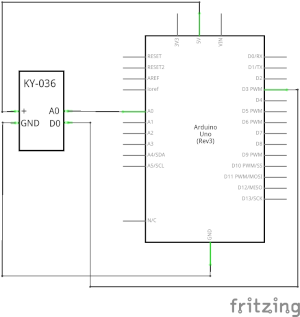
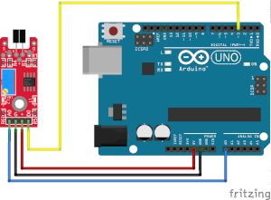

# 26 - Mòdul de sensor tàctil

## Descripció general

En aquest experiment, aprendrem a usar el mòdul de sensor tàctil.

## Material

|                               Imatge                               | Descripció                      |
| :----------------------------------------------------------------: | :------------------------------ |
|   | Arduino Uno o equivalent.       |
|  | Cables de connexió              |
|  | Un mòdul de sensor tàctil KY036 |

## Mòdul sensor tàctil

Interruptor sensible al tacte. Tocar el pin del sensor produeix una
eixida en el pin 'DO'. L'eixida no és un senyal net, perque inclou
senyals induïts per la xarxa de 50 Hz ("brunzit de xarxa"). El senyal
d'eixida és "alta activa" i la sensibilitat del circuit es pot
ajustar amb un potenciòmetre. Un senyal d'eixida analògica del sensor
està disponible en el pin 'AO'.


## Muntatge




## Programació

Codi ARD026a

```Arduino
/*
* Projecte nº: ARD026a
* Data: 19/01/2022
* Descripcio: Us de la eixida analogica del sensor tactil
* Nota:
*
*/

int sensorPin = A0; // pin d'entrada del potenciometre
int ledPin = 13; // pin per al LED
int sensorValue = 0; // variable valor del sensor

void setup()
{
  pinMode(ledPin,OUTPUT);
  Serial.begin(9600);
}

void loop()
{
  sensorValue = analogRead(sensorPin);
  digitalWrite(ledPin, HIGH);
  delay(sensorValue);
  digitalWrite(ledPin, LOW);
  delay(sensorValue);
  Serial.println(sensorValue, DEC);
}
```

Codi ARD026b

```Arduino
/*
* Projecte nº: ARD026b
* Data: 19/01/2022
* Descripcio: Us de la eixida digital del sensor tactil
* Nota:
*
*/

int Led=13;//pin per al LED
int buttonpin=3; //eixida DO del sensor
int DOval;//variable digital

void setup()
{
  pinMode(Led,OUTPUT);//define LED as a output port
  pinMode(buttonpin,INPUT);//define switch as a output port
}

void loop()
{
  DOval=digitalRead(buttonpin);
  if(DOval==HIGH)//when the switch sensor have signal, LED blink
  {
    digitalWrite(Led,HIGH);
  }
  else
  {
    digitalWrite(Led,LOW);
  }
}
```

## Veure també

- [README](../README.md)
