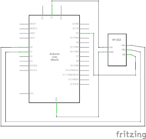
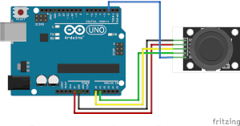

# 28 - Mòdul Joystick

## Descripció general

Igual que un joystick en la consola de jocs, pot controlar l'entrada de
dimensions x, y i z mitjançant aquest mòdul de joystick. Es pot
considerar com una combinació de potenciòmetres i un botó. El tipus de
dades de les dimensions x, y són senyals d'entrada analògiques i la
dimensió z és un senyal d'entrada digital. Per tant, els ports x e y es
connecten als pins analògics del mòdul, mentre que el port z es connecta
al pin digital.

## Mòdul joystick

Un joystick analògic de 2 eixos amb 2 potenciòmetres de 10K ohms i
funció de polsador. Les descripcions dels pins del connector estan
impreses en la PCB. S'inclou una perilla d'operació a pressió amb el
mòdul.


## Material

|                               Imatge                               | Descripció                |
| :----------------------------------------------------------------: | :------------------------ |
|   | Arduino Uno o equivalent. |
|  | Cables de connexió        |
|  | Un mòdul joystick KY023   |

## Descripció dels components

### Sensor joystick

Molts projectes de robots necessiten joystick. Aquest mòdul proporciona
una solució assequible. Simplement connectant-ho a dues entrades
analògiques, el robot està a les seues ordres amb control X, Y. També té
un interruptor que està connectat a un pin digital. Aquest mòdul de
joystick es pot connectar fàcilment a Arduino.

### Especificacions

- Voltatge de subministrament: 3.3V a 5V
- Interfície: Analògic x2, Digitalx1 Grandària: 40x28mm
- Pes: 12g

El mòdul té 5 pins: Vcc, GND, X, Y, Key. Teniu en compte que les
etiquetes poden ser lleugerament diferents, depenent d'on vas obtindre
el mòdul. El joystick és analògic i hauria de proporcionar lectures més
precises que els simples joysticks "direccionals" que usen algunes
formes de botons o interruptors mecànics. A més, pots pressionar el
joystick cap avall per a activar un botó de "pressionar per a
seleccionar".

Hem d'usar pins analògics d'Arduino per a llegir les dades dels pins
X/Y i un pin digital per a llegir el botó. El pin clau està connectat a
terra, quan es pressiona el joystick, i està surant en cas contrari. Per
a obtindre lectures estables del pin Key/Select, ha de connectar-se a
Vcc a través d'una resistència pull-up.

## Muntatge




## Programació

Els joysticks analògics són bàsicament potenciòmetres, per la qual cosa
retornen valors analògics. Quan el joystick està en la posició de repòs
o neutral, ha de retornar un valor d'aproximadament 512, amb valors que
van de 0 a 1023.

A més; SW (eix Z) és un senyal d'entrada digital, connectada al port
digital, i habilita la resistència pull-up. Valor de SW: 1 significa no
pressionat, 0 significa pressionat.

Codi: ARD028

```Arduino
/*
* Projecte nº: ARD028
* Data: 22/01/2022
* Descripcio: Lectura dels valors del joystick
* Nota:
*
*/

const int SW\_pin = 2; // pin digital per a boto
const int X\_pin = A1; // pin analogic per a X
const int Y\_pin = A0; // pin analogic per a Y

void setup() {
  pinMode(SW\_pin, INPUT);
  digitalWrite(SW\_pin, HIGH);
  Serial.begin(9600);
}

void loop() {
  Serial.print("Boto: ");
  Serial.print(digitalRead(SW\_pin));
  Serial.print("\\n");
  Serial.print("X-eix: ");
  Serial.print(analogRead(X\_pin));
  Serial.print("\\n");
  Serial.print("Y-eix: ");
  Serial.println(analogRead(Y\_pin));
  Serial.print("\\n");
  delay(500);
}
```

## Veure també

- [README](../README.md)
