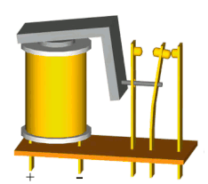
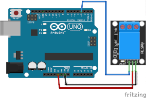

# 32 - Mòdul de relé

## Descripció general

En aquest experiment, aprendrem a usar el mòdul de relé.

Un **relé** és un dispositiu electromagnètic, que permet modificar
l'estat d'un commutador elèctric gràcies a l'electricitat. A grans
trets, és un commutador elèctric que és accionat per un electroimant que
obre o tanca un o diversos contactes. Una característica important
d'aquest component és que permet controlar circuits elèctrics de
voltatge o intensitat més elevada, amb un senyal elèctric de comandament
molt inferior al que es pretén commutar.

## Mòdul de relé

Un mòdul de relé adequat per a la connexió directa a una placa Arduino.
El mòdul requereix una font d'alimentació de 5 V. El senyal de control
d'entrada s'identifica amb una 'S'. El relé té un contacte inversor.
És capaç de commutar càrregues resistives de fins a 10 A a 250 VAC i de
fins a 10 A a 30 V com a màxim.


## Introducció als components

### Relé

Un relé és un interruptor accionat elèctricament. Molts relés usen un
electroimant per a operar mecànicament un interruptor, però també
s'usen altres principis operatius, com els **relés d'estat sòlid**.
Els relés s'utilitzen quan és necessari controlar un circuit mitjançant
un senyal de baixa potència (amb aïllament elèctric complet entre el
control i els circuits controlats), o quan diversos circuits han de ser
controlats per un sol senyal.




Un tipus de relé que pot manejar l'alta potència requerida per a
controlar directament un motor elèctric o altres càrregues es diu
**contactor**. Els relés d'estat sòlid controlen els circuits de
potència sense parts mòbils, sinó que utilitzen un dispositiu
semiconductor per a realitzar la commutació.

Els relés amb característiques operatives calibrades i, a vegades,
múltiples bobines operatives s'utilitzen per a protegir els circuits
elèctrics de sobrecàrregues o falles; en els sistemes d'energia
elèctrica moderns, aquestes funcions les realitzen instruments digitals
que encara es denominen "**relés de protecció**".

## Material

|                               Imatge                               | Descripció                |
| :----------------------------------------------------------------: | :------------------------ |
|   | Arduino Uno o equivalent. |
|  | Cables de connexió        |
|  | Mòdul relé KY019          |

## Connexió




## Programació

```Arduino
/*
* Projecte nº: ARD32
* Data: 31/01/2022
* Descripcio: Prova del modul rele
* Nota:
*
*/

int relayPin = 3;

void setup()
{
  pinMode(relayPin, OUTPUT);
}

void loop()
{
  digitalWrite(relayPin, HIGH);
  delay(2000);
  digitalWrite(relayPin, LOW);
  delay(2000);
}
```

## Veure també

- [README](../README.md)
