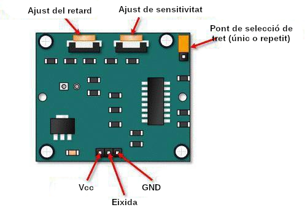
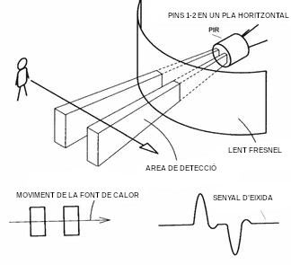
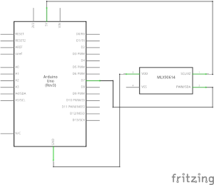
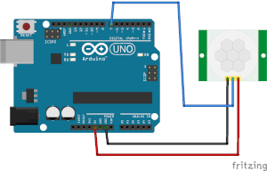

# 35 - Mòdul sensor PIR HC-SR501

## Descripció general

En aquesta lliçó aprendrà a utilitzar un detector de moviment PIR amb un
Arduino UNO.

L'arduino UNO és el cor d'aquest projecte. 'Escolta' al sensor PIR i
quan detecta moviment, indica al LED que s'encenga o s'apague.

## Material

|                                Imatge                                | Descripció                |
| :------------------------------------------------------------------: | :------------------------ |
|     | Arduino Uno o equivalent. |
|    | Cables de connexió        |
|  | Módul sensor PIR HC-SR501 |

## Introducció als components



### Sensor pir

Els sensors PIR són més complicats que molts dels altres sensors
explicats en aquest tutorial (com a fotocèl·lules, interruptors
d'inclinació, ...) perquè existeixen múltiples variables que afecten
l'entrada i eixida dels sensors.

El sensor PIR en si té dues ranures. Cada ranura està feta d'un
material especial que és sensible a IR. La lent utilitzada ací realment
no està fent molt, per la qual cosa veiem que les dues ranures poden
'veure' més enllà d'una certa distància (bàsicament, la sensibilitat
del sensor). Quan el sensor està inactiu, totes dues ranures detecten la
mateixa quantitat d'IR, la quantitat ambiental radiada des de
l'habitació, les parets o l'exterior. Quan passa un cos calent com un
ésser humà o un animal, primer intercepta la meitat del sensor PIR, la
qual cosa provoca un canvi diferencial positiu entre les dues parts.
Quan el cos calent ix de l'àrea de detecció, ocorre el contrari, per la
qual cosa el sensor genera un canvi diferencial negatiu. Aquests polsos
de canvi són el que es detecta.



| Pin del mòdul            | Funció                                                                                                |
| ------------------------ | ----------------------------------------------------------------------------------------------------- |
| Ajust de retard          | Estableix quant temps roman alta l'eixida després de detectar moviment.... Entre 5 segons i 5 minuts. |
| Ajust de sensibilitat    | Estableix el rang de detecció... de 3 metres a 7 metres                                               |
| Pont de selecció de tret | Joc de ponts per a trets simples o repetibles.                                                        |
| GND                      | GND                                                                                                   |
| Pin d'eixida             | LOW quan no es detecta moviment. HIGH quan es detecta moviment.                                       |
| Vcc                      | Alimentació                                                                                           |

## HC SR501 PIR Descripció funcional

El SR501 detectarà canvis infrarojos i, si s'interpreta com a moviment,
establirà la seua eixida en un nivell alt. El que s'interpreta o no com
a moviment depén en gran manera de la configuració i els ajustos de
l'usuari.

### Inicialització del dispositiu

El dispositiu requereix quasi un minut per a inicialitzar-se. Durant
aquest període, pot emetre senyals de detecció falses, i amb freqüència
ho farà. La lògica del circuit o del controlador ha de tindre en compte
aquest període d'inicialització.

### Àrea de detecció del dispositiu

El dispositiu detectarà moviment dins d'un con de 110 graus amb un
abast de 3 a 7 metres.


### HC SR501 Àrea de visualització

Ajust del rang PIR (Sensibilitat) com es va esmentar, el rang ajustable
és d'aproximadament 3 a 7 metres. La següent taula mostra aquest ajust.

|                                Gir                                 | Descripció                                                                                                      |
| :----------------------------------------------------------------: | :-------------------------------------------------------------------------------------------------------------- |
|  | Cap a la dreta. Disminuir la sensibilitat. Totalment a la dreta i l'abast serà d'aproximadament 3 metres.       |
|  | Cap a l'esquerra. Augmenta la sensibilitat. Completament a l'esquerra i l'abast serà d'aproximadament 7 metres. |

### HC SR501 Ajust de retard de temps

L'ajust de retard de temps determina quant temps romandrà alta
l'eixida del mòdul del sensor PIR després de la detecció de moviment.
El rang és d'aproximadament 3 segons a cinc minuts.

|                                Gir                                 | Descripció                                                                                                        |
| :----------------------------------------------------------------: | :---------------------------------------------------------------------------------------------------------------- |
|  | Cap a la dreta. Augmentar el retard. Totalment a la dreta i el retard serà d'aproximadament 5 min.                |
|  | Cap a l'esquerra. Augmenta la sensibilitat. Completament a l'esquerra i el retard serà d'aproximadament 3 segons. |

**IMPORTANT**: són necessaris 3 segons d'inactivitat desprès que es complete
el temps de retard.

L'eixida d'aquest dispositiu passarà a BAIX (o apagat) durant
aproximadament 3 segons després que finalitze el temps de retard. En
altres paraules, tota la detecció de moviment es bloqueja durant aquest
període de tres segons.

Per exemple:

Imagina que estàs en el mode de tret únic i el teu temps de retard està
establit en 5 segons. El PIR detectarà moviment i ho configurarà alt
durant 5 segons. Després de cinc segons, el PIR establirà la seua eixida
baixa durant uns 3 segons. Durant els tres segons, el PIR no detectarà
moviment. Després de tres segons, el PIR detectarà moviment novament i
el moviment detectat establirà una vegada més l'eixida alta.

### Pont de selecció de mode de tret

El pont de selecció de mode de tret li permet seleccionar entre trets
simples i repetibles. L'efecte d'aquesta configuració de pont és
determinar quan comença el retard de temps.

- **DISPARADOR ÚNIC**: el temps de retard comença immediatament quan es
  detecta moviment per primera vegada.
- **DISPARADOR REPETIBLE**: cada moviment detectat restableix el retard de
  temps. Així, el retard de temps comença amb l'últim moviment
  detectat.

## Connexió




## Programació

**Codi:ARD035**

```Arduino
/*
* Projecte nº: ARD035
* Data: 07/02/2022
* Descripcio: Prova del sensor HC SR501
* Nota:
*
*/

const int LEDPin= 13;
const int PIRPin= 2;

void setup()
{
  pinMode(LEDPin, OUTPUT);
  pinMode(PIRPin, INPUT);
}

void loop()
{
  int value= digitalRead(PIRPin);
  if (value == HIGH)
  {
    digitalWrite(LEDPin, HIGH);
    delay(50);
    digitalWrite(LEDPin, LOW);
    delay(50);
  }
  else
  {
    digitalWrite(LEDPin, LOW);
  }
}
```

## Veure també

- [README](../README.md)
