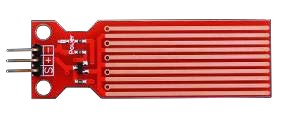
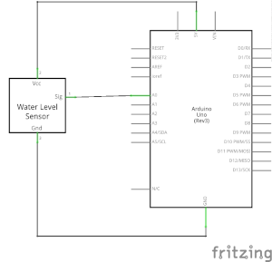

# 36 - Mòdul sensor de detecció de nivell d'aigua

## Descripció general

En aquesta lliçó, aprendrà a usar un mòdul de sensor de detecció de
nivell d'aigua. Aquest mòdul pot percebre la profunditat de l'aigua i
el component central és un circuit amplificador que es compon d'un
transistor i diverses rutes de PCB pectinades. Quan es col·loquen en
l'aigua, aquestes rutes presentaran una resistència que pot canviar
juntament amb el canvi de la profunditat de l'aigua. Després, el senyal
de la profunditat de l'aigua es converteix en senyal elèctric i podem
conéixer el canvi de la profunditat de l'aigua a través de la funció
ADC d'UNO R3.



## Material

|                                  Imatge                                  | Descripció                       |
| :----------------------------------------------------------------------: | :------------------------------- |
|         | Arduino Uno o equivalent.        |
|        | Cables de connexió               |
|  | Mòdul sensor de detecció d'aigua |

## Introducció de components

### Sonda d'aigua:

Aquest bloc està dissenyat per a la detecció d'aigua, i pot ser
àmpliament utilitzat per a detectar la pluja, el nivell de l'aigua i
fins i tot la fugida de líquid. El bloc es compon principalment de tres
parts: un connector de bloc electrònica, una resistència d'1 MΩ i
diverses línies de conductors nus.

Aquest sensor té una sèrie de pistes exposades connectades a terra, i
alternades entre les línies de terra estan les pistes sensitives.

Les línies del sensor tenen una resistència pull-up d'1 MΩ. Aquesta
resistència ficarà el valor de la eixida de sensor a HIGH fins que
l'aigua curtcircuite la pista del sensor amb la pista connectada a
terra. Ho crega o no, aquest circuit funcionarà amb els pins de E/S
digital de la seua placa UNO R3 o pot usar-ho amb els pins analògics per
a detectar la quantitat de contacte induït per aigua entre les línies
del sensor i la connexió a terra.

Té baix consum d'energia i alta sensibilitat.

### Característiques:

- Voltatge de funcionament: 5V
- Corrent de treball: <20ma
- Interfície: Analògic
- Ample de detecció: 40 mm × 16 mm
- Temperatura de treball: 10 ℃ ~ 30 ℃ 6
- Senyal de voltatge d'eixida: 0 ~ 4.2V

## Connexió




## Programació

```Arduino
/*
* Projecte nº: ARD036
* Data: 07/02/2022
* Descripcio: Prova del sensor detector d'aigua
* Nota:
*
*/

int adc_id = 0;
int HistoryValue = 0;
char printBuffer[128];

void setup()
{
    Serial.begin(9600);
}

void loop()
{
    int value = analogRead(adc_id);
    if(((HistoryValue >= value) && ((HistoryValue - value) > 10)) || ((HistoryValue < value) && ((value - HistoryValue) > 10)))
    {
        sprintf(printBuffer,"ADC%d level is %d\n",adc_id, value);
        Serial.print(printBuffer);
        HistoryValue = value;
    }
}
```

## Veure també

- [README](../README.md)
